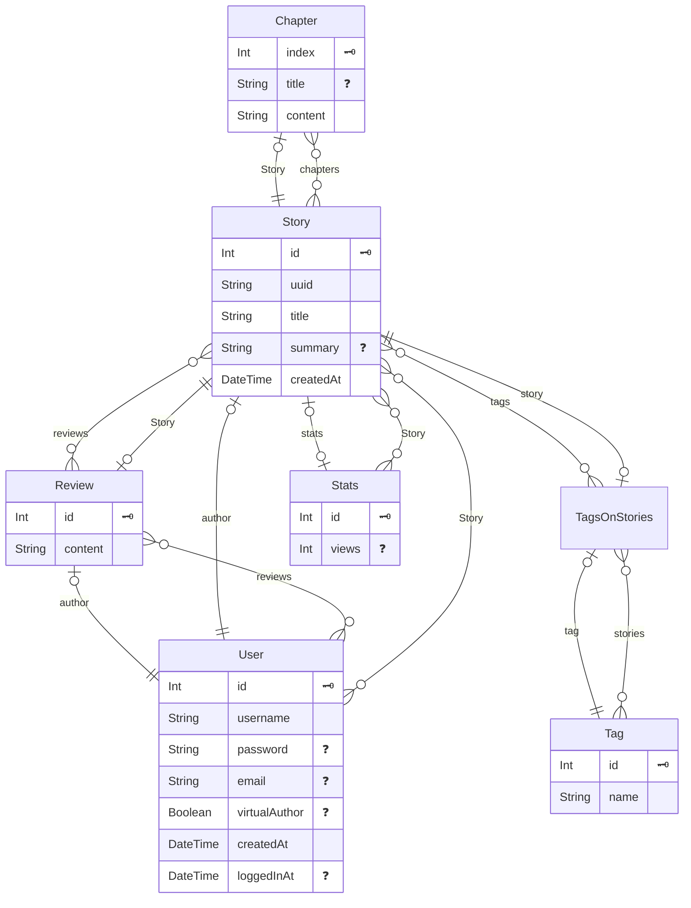

```mermaid
erDiagram

  "Chapter" {
    Int index "🗝️"
    String title "❓"
    String content 
    }
  

  "Review" {
    Int id "🗝️"
    String content 
    }
  

  "Story" {
    Int id "🗝️"
    String uuid 
    String title 
    String summary "❓"
    DateTime createdAt 
    }
  

  "Tag" {
    Int id "🗝️"
    String name 
    }
  

  "TagsOnStories" {

    }
  

  "Stats" {
    Int id "🗝️"
    Int views "❓"
    }
  

  "User" {
    Int id "🗝️"
    String username 
    String password "❓"
    String email "❓"
    Boolean virtualAuthor "❓"
    DateTime createdAt 
    DateTime loggedInAt "❓"
    }
  
    "Chapter" o|--|| "Story" : "Story"
    "Review" o|--|| "Story" : "Story"
    "Review" o|--|| "User" : "author"
    "Story" o{--}o "Chapter" : "chapters"
    "Story" o{--}o "Review" : "reviews"
    "Story" o|--|| "User" : "author"
    "Story" o|--|o "Stats" : "stats"
    "Story" o{--}o "TagsOnStories" : "tags"
    "Tag" o{--}o "TagsOnStories" : "stories"
    "TagsOnStories" o|--|| "Tag" : "tag"
    "TagsOnStories" o|--|| "Story" : "story"
    "Stats" o{--}o "Story" : "Story"
    "User" o{--}o "Review" : "reviews"
    "User" o{--}o "Story" : "Story"
```
